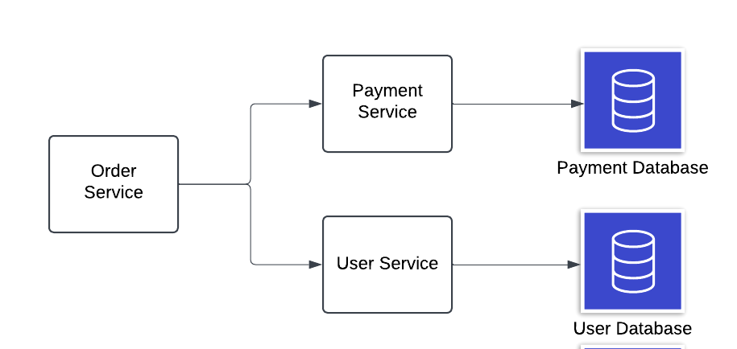
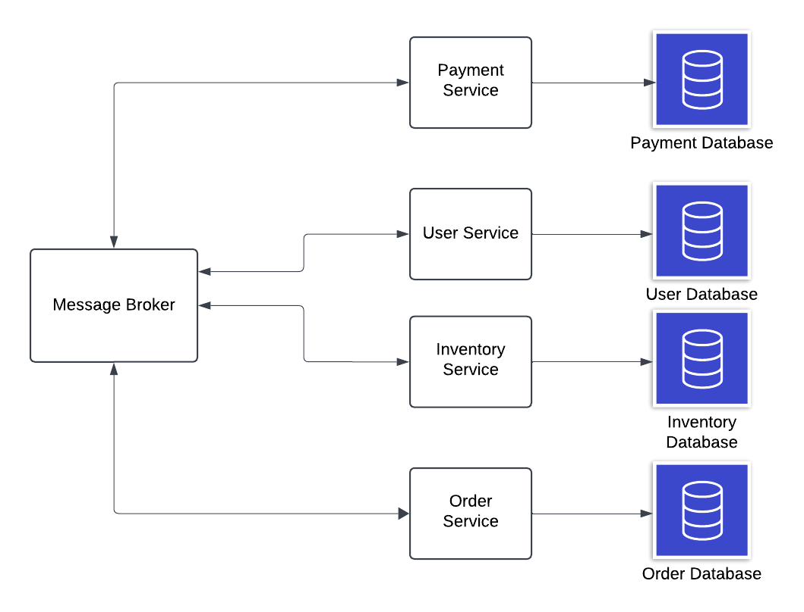

# Databases and Microservices

## What am I talking about?
When designing a monolith application, all of the tables are in one database. Because usually you're only relying on one database schema. Unless you've had some experience with sharding, then maybe you've experienced this before. Let's say you have an e-commerce platform with users, products, and orders. 

- **Monolith Approach:** Since everything is in one application, all of these tables such as users, products, orders are all in one place. You can easily create relationships between the data, everything is easy.
- **Microservices Approach:** Your application could have a different service for user, product, and orders. This means 3 separate databases. So how do we do the relationship between user and orders now? They're in different databases, so we can't even do foreign keys anymore. This is what we're trying to solve 

There are two main options for organizing databases when using microservice architecture:
1. Database per service.
2. Shared database, which just means all microservices use the same database.


## Shared Database
An 'anti-pattern' really since using a shared database will cause microservices to lose that core idea of scalability and independence. I mean the whole reason you're using microservices in the first place is for that scalability and independence, so this approach is rarely used with microservices. If you're thinking about using a shared database, then you should consider a monolith architecture.

It isn't uncommon, you may see it as a temporary state in a project when they're transitioning from monolith to microservices. With this, transactions are handled in one database, and complex queries are easy. However, it's not going to easily scale, and changes to the databases can impact all services. Also you can run into issues with database deadlocks. In a dbms, a deadlock happens when two or more transactions are waiting for each other to release resources, and as a result none of the transactions can resolve. 

Imagine a you have your users and payment service. If the payment service needs to do a transaction, it's going to put a 'lock' on that table to ensure no other services can alter that table whilst the payment service is doing the transaction. This can not only create issues in terms of response time, and this happened because you have multiple servers relying on the same database. 

## Database Per Service
A better idea is having a payment service interact with a payment database, and the user service interact with a user database. This is the idea of 'database per service', where each service connects to its own database. The idea behind microservices is loose coupling, scalable, and independent in terms of development and deployment.

Let's talk advantages and disadvantages:
1. **Advantages:** Changing a database doesn't impact other services, just the one connected to that database. Also scaling a given database or service won't affect others, saving computing and financial resources. It's also a better developer experience to only need to worry about one component of an entire system, making you easier to onboard and learn. Finally it's the idea of 'polyglot persistence', meaning your backend can use multiple different types of databases. Maybe service A uses Postgres, whilst B and C use MongoDB or Cassandra.
- **Disadvantages:** A microservice can only access it's own data. If we want to communicate and exchange data to do something great, we'll need to provide clear APIs. We also need failure mechanisms. For example, if we're doing a payment request, service A sends a request to service B, and let's say service B goes offline. We need to inform service A about what happened and when B is back online. The **circuit breaker** mechanism will help out. Also **transactions** across microservices will be challenging, and some consistency or atomicity will be affected. Also executing joins across databases will be complex. Lastly, debugging across microservices will be hard.


## Looking at data-related patterns and solutions
Here’s a clearer and more structured version of your notes:

---

## **Data-Related Patterns and Solutions**

### 1. **Two Phase Commit (2PC)**

Let's say you have an Order service. This service will talk to the payment and the user service in order to complete an order (do a transaction). So it orchestrates things. So we'll have two phases:

1. Prepare Phase: Tells the payment and user services to prepare for a database update. So both services should start their transactions. Let's the payment service doesn't run into any problems, so before committing any changes, it tells the order service that everything is good and its ready to commit its payment related changes. So if the user service is also good, the order service can tell both services to move into the second stage. Else, maybe the user service has run into some problems, then the order service can tell them both to cancel the transactions and rollback any changes.
2. Commit Phase: At this point, there have been no errors so both services commit their changes, and the transaction is complete!

However, imagine that we had to involve 3 or 4 more microservices? Services to handle product inventory, notification services to email the user, etc. The order service would have to orchestrate like 7 or 8 different services, and that's messy. That's where the **Saga** pattern comes in.

### 2. **Saga Pattern (Distributed Transactions)**

The order service publishes a message/event that the payment service is listening for (subscribed). The payment service takes action executes its own transaction, and on completion, it'll publish a message. The user service listens and continues the process. Now let's say the payment service didn't complete successfully, then the user and inventory services won't have any updates. So we just rollback and cancel anything that happened in the payment and order services.

We break down a large distributed transaction into multiple **local transactions**. Each service executes its local transaction and, upon success, triggers the next service to initiate its transaction. If a local transaction fails, the system rolls back any changes made so far.

#### **Implementation Types**:
1. **Orchestration**:
   - A central controller (or orchestrator) manages all interactions between microservices.
   - Ensures each step of the transaction executes in the correct order.
2. **Choreography**: This the type in the example we used above.
   - Microservices broadcast events.
   - Each service listens for relevant events and responds accordingly.
   - No central controller—interactions are event-driven.

### 3. **API Composition (Querying Data)**
Now let's say you wanted some data from the order service about the payment information and the user who payed. So to do that, the order service would talk to the payment and user services to get that data, organize it, and return it. This is a perfectly fine pattern, and it makes sense when you want to aggregate related data that managed by different microservices.

---
### 2. **CQRS (Command Query Responsibility Segregation)**
It's good practice to separate our databases S.T. any read requests/queries are directed to databases that are dedicated to processing reads, and any writes are directed to other databases. You probably already know about this from database replication. The benefit of doing this is that, now you can independently scale up if you want to handle more reads or writes respectively. This is called CQRS. However you should know that this is different from database replication, as CQRS could involve completely different schemas for the read and write databases.

Though you'll need to have some kind of replication so that after every write, the changes are propagated to your read databases. However, maybe your changes aren't that critical, I mean it's not that important for people to see the changes in a user's profile a couple seconds after the change has been made. This is why CQRS is listed as 'eventual consistency'.

#### CQRS Example
Imagine you have an e-commerce platform that you know has a lot more read requests than write requests.

Here's an example of your write database. It's normalized to avoid redundancy and maintain integrity
```
Tables:
1. Users
   - id (PK)
   - name
   - email
   - address

2. Products
   - id (PK)
   - name
   - description
   - price
   - stock_quantity

3. Orders
   - id (PK)
   - user_id (FK)
   - order_date
   - status

4. Order_Items
   - id (PK)
   - order_id (FK)
   - product_id (FK)
   - quantity
   - price_at_order_time
```
The read database is designed for fast queries, so it may have some denormalization. So here we'll use MongoDB, a NoSQL technology, with this schema:
```
Collections/Tables:
1. ProductCatalog
   {
      "id": "123",
      "name": "Smartphone",
      "description": "Latest model",
      "price": 799.99,
      "stock_quantity": 45,
      "coverImageUrl": ...,
      "productImageList": [...]
   }

2. OrderSummaries
   {
      "id": "456",
      "user_id": "789",
      "user_name": "John Doe",
      "order_date": "2024-11-25",
      "status": "Delivered",
      "items": [
         {
            "product_id": "123",
            "name": "Smartphone",
            "quantity": 2,
            "price": 799.99
         },
         {
            "product_id": "456",
            "name": "Wireless Charger",
            "quantity": 1,
            "price": 29.99
         }
      ]
   }
```
So the OrderSummaries provides a complete view of an order with minimal joins. The ProductCatalog would be optimized for product browsing. We may even include things such as the images related to the product as well.

---
### 3. **Event Sourcing**
- Instead of storing the current state of an entity, store a **series of events** that represent changes made to that entity over time.

#### **How It Works**:
1. **Create Events**:
   - Every action triggers an event (e.g., `OrderPlaced`, `ItemAddedToCart`).
2. **Store Events**:
   - Events are saved in persistent storage (e.g., a database or event store).
   - Events can also be distributed via tools like Kafka or RabbitMQ for inter-service communication.
3. **Reconstruct State**:
   - To determine the current state of an entity, replay its events sequentially.
   - **Snapshots** can be used to optimize this process by saving the current state at specific points.

#### **Example (Banking App)**:
- **Events**:
  1. `AccountCreated` (balance = $0)
  2. `DepositMade` (balance += $100)
  3. `WithdrawalMade` (balance -= $30)
- **Current Balance**:
  - Replay the events: $0 + $100 - $30 = $70.
- **Snapshots**:
  - If a user has 1000+ transactions, save a snapshot (e.g., balance at event #950) and replay only the remaining events.

---


### **When to Use Each Pattern**

#### **Saga Pattern**:
- Use when:
  - Transactions span multiple microservices.
  - Rollbacks or compensation actions are necessary.
- Example: Completing a checkout process that involves inventory, payments, and shipping.

#### **CQRS**:
- Use when:
  - Read and write workloads have different performance requirements.
  - You want to decouple query and command logic for scalability.
- Example: An e-commerce system where user queries (product browsing) are frequent, but commands (purchasing) are less frequent.

#### **Event Sourcing**:
- Use when:
  - You need a full audit trail of changes.
  - You want to support replaying or undoing events.
- Don’t use when:
  - The system doesn't need historical data or event replay.
  - Simplicity and fast queries are more important.

---

### **Key Differences**
| **Pattern**           | **Focus**                                  | **Example Use Case**                     |
|------------------------|--------------------------------------------|------------------------------------------|
| **Saga**              | Managing distributed transactions          | E-commerce checkout process              |
| **CQRS**              | Separating read and write responsibilities | Optimizing product browsing vs ordering  |
| **Event Sourcing**    | Storing events instead of current state     | Banking transaction logs, audit trails   |


## Picking a database technology
When picking the actual DBMS or technology to store data, we'll need to ask some questions:
1. **Read performance:** This can be the latency (how fast your fetch queries are) or throughput (num. queries per second). Applications or services like e-commerce or banking software wants data to be fetched fast.
2. **Write performance:** If the service needs to persist a lot of data and fast, this is important.
3. **Latency:** Live streaming apps or real-time gaming apps want low latency.
4. **Resource efficiency:** We want to consume the least amount of resources as possible.
5. **Development Efficiency:** How does this impact our development, deployment, and tests on the microservices.?

# Credits:
1. [Database Design in a Microservices Architecture](https://www.baeldung.com/cs/microservices-db-design)
2. [Microservices with Database can be challenging](https://youtu.be/tiHKefWOyrY?si=CU9CnPXLon3-e3-Z)