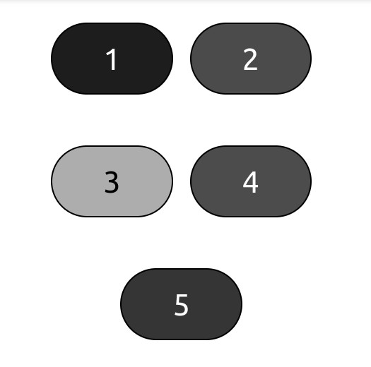

# Color Accessibility
Using the wrong color combinations can make things hard to read, so we have to be careful

## Color contrast
The contrast between a text color and background color can be called 'contrast ratio'. Formally, it's the difference in brightness between two colors, express as a ratio. For example white text on a white background has the lowest ratio (1:1), while black text on a white background has the highest ratio (21:1). The higher the ratio, the biggest the contrast.

For contrast ratios we only have levels AA and AAA, both define rules for 'normal and 'large' text. 
- Normal text: Has font size less than 18 pts, or less than 14 pts for bold text.
- Large text: Has font size that's at least 18 pts or at least 14 pts for bold text.
1. Level AA (minimum): Contrast ratio of at least 4.5:1 for normal text, and 3:1 for large text.
2. Level AAA (enhanced): At least 7:1 for normal text and 4.5:1 for large text.

## Calculating and checking contrast
Use [WebAim Contrast checker](https://webaim.org/resources/contrastchecker/) to check contrast ratios. It's one of WebAim's evaluation services, and will calculate contrast ratios and the conformance levels for you. You could also Chrome Dev Tools, and hover over the text, and it'll show you the contrast ratio.

## Conveying information without color
To account for color-blindness, we shouldn't rely on the color of something to convey information. There may be exceptions to this, but you generally want to follow this rule. 

### Button example
How about an example, where the user needs to click on the red button in order to get to the home page. Now if the user is color blind, they'll see five buttons greyed out, with some 'variation' between gray. The picture below illustrates what it would look like for a person with complete color-blindness. The red button is actually the button with number '4', but we don't know that since it's greyed out.

### Form example
Let's create a form where, all the required fields are indicated by red text. If the user is color-blind this is going to be hard, since we only rely on color. So rather than solely relying on color, the form could indicate a required field with red text AND an asterisk.

